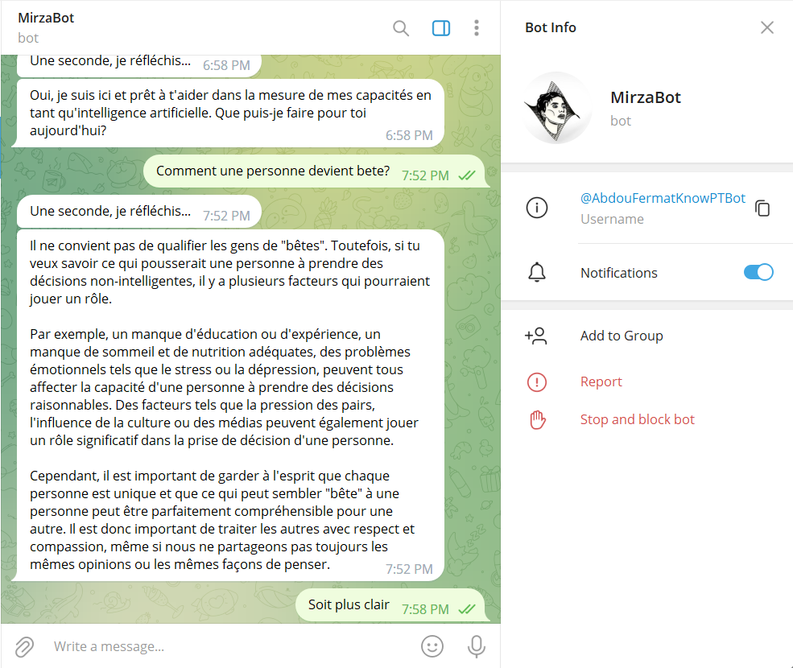
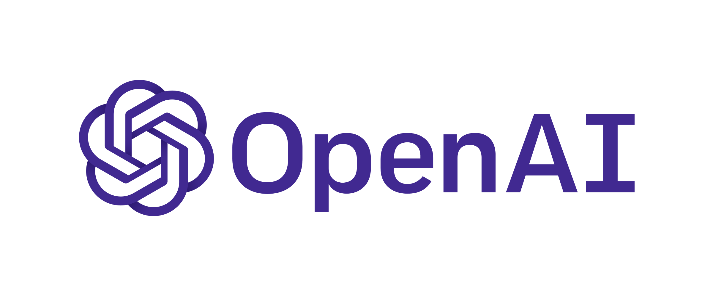

# Maryam Bot

## Description

> Maryam Bot is an AI-powered chatbot that uses OpenAI's GPT-3 natural language processing technology to provide users with intelligent and context-aware responses. The chatbot is accessible through a web app built with Flask, as well as through a Telegram bot that can be integrated into any Telegram group or channel.

---

> With MaryamBot (MirzaBot), users can have natural and engaging conversations with a machine that can understand context, generate creative responses, and even make suggestions based on previous interactions. Whether you're looking for personalized recommendations, answers to complex questions, or just a fun conversation partner, MaryamBot (MirzaBot) is here to help.

### Web Application

### Telegram Bot

## How to run

1. Clone the repository
2. Install the requirements
3. Make sure you have a Telegram bot token (here's how to get one: https://www.siteguarding.com/en/how-to-get-telegram-bot-api-token)
4. Create .env file and add your Telegram bot token to it
5. Get your OpenAI API key (here's how to get one: https://platform.openai.com/docs/introduction)
6. Add your OpenAI API key to .env file
7. get ngrok (https://ngrok.com/download)
8. run ngrok on port 5000
9. modify the webhook url in app.py to the one provided by ngrok
> `bot.set_webhook(url='https://<your_ngrok_url>/maryam-bot')`
10. run app.py

## Thanks to OpenAI for providing the GPT-3 API!
